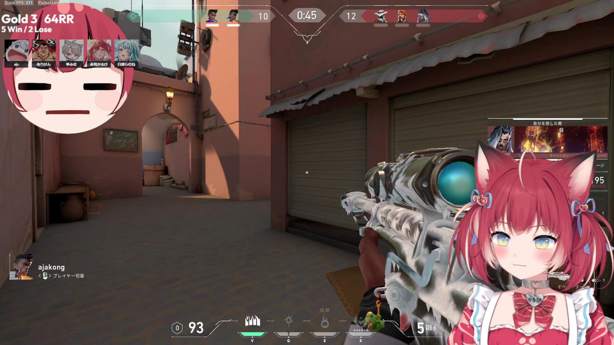
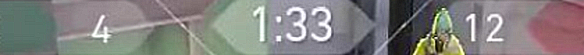
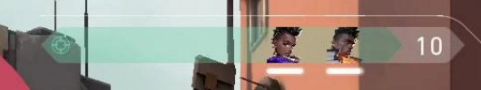
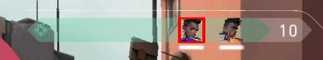
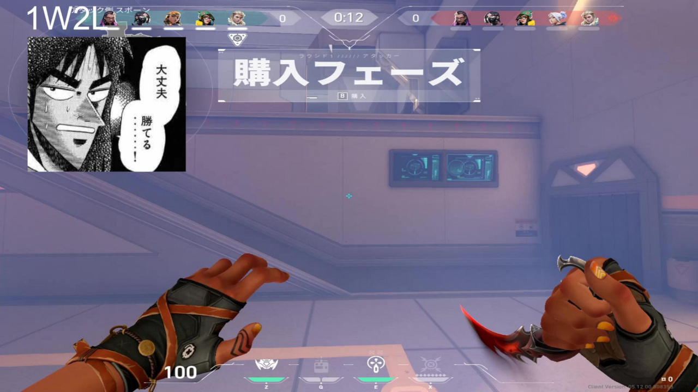
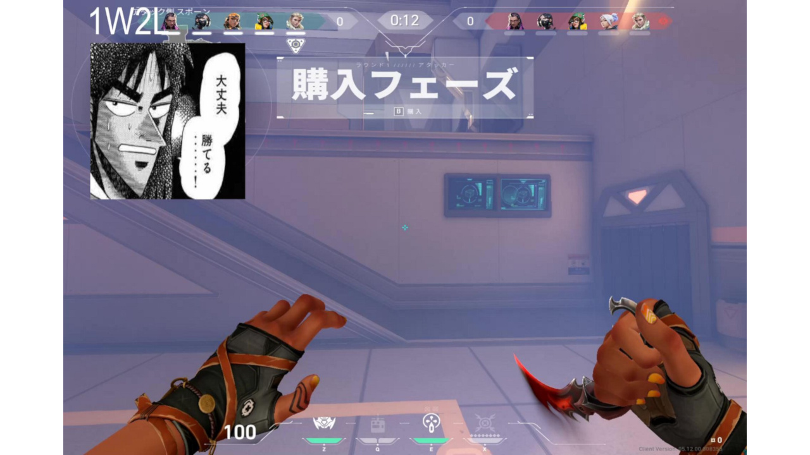

# vlr-matchups

**vlr-matchups** is a bunch of scripts that make use of computer vision to deduce if persons playing *Valorant*, a
first-person tactical hero shooter, live on Twitch.tv, are in the same match playing with or against each other, just by
looking at still images of their video streams.

A live version can be accessed at:
https://vlr-matchups.net

## Write-up

### Theory

In Valorant, two teams consisting of five heroes (or agents) per team are playing against each other for multiple
rounds.
The agents are selected from an agent pool before the match and can not be changed during the match.
Agents are only unique in regard to one team.

By correlating the team composition, as well as the in-game score seen by two players at a given moment it is possible
to calculate a correlation coefficient, and thus how likely it is that they are playing the same match together or
against each other.

### Raw data acquisition

The first step was to get a list of all streams on Twitch.tv that are currently broadcasting Valorant
gameplay. Luckily this was very easy as Twitch provides
an [extensive API](https://dev.twitch.tv/docs/api/reference#get-streams).
To get access, only a regular Twitch user account is needed; no additional steps or separate developer verification are
required. Quite refreshing for a change.

Now that I have a list of streams I needed to access their content. At first, I thought about capturing still images of
the actual video streams myself. This would have been a rather involved process, but definitely doable, thanks
to [streamlink](https://github.com/streamlink/streamlink), ffmpeg or gstreamer.

Instead, I noticed that you can access the preview images of the streams rather easily:

> A URL to an image of a frame from the last 5 minutes of the stream. Replace the width and height placeholders in the
> URL ({width}x{height}) with the size of the image you want, in pixels.

Meaning Twitch does all the work of capturing the stills for me anyway. The only downsides I could think of are
the rather limited resolution, and the delay[^1] between the live content and the preview stills.
Before trying anything more complicated I wanted to give it a try and see how far I can get with this approach.

So the problem now boiled down to fetching a number of JPEGs via HTTP. Perfect! And
using [aiohttp](https://docs.aiohttp.org/en/stable/) this was also extremely
fast.

[^1]: The delay, or rather the long cache interval turned out not be a problem at all. Check the source code if you want
to see
why. ;)

### Score detection

After retrieving all the images, it was time to start extracting the information needed for comparison.

For example, here’s what a generic stream and the Valorant HUD looks like:



In the following examples I used another image to illustrate the process for a background that is more busy.

As the HUD can not be changed by the player, and the position is more or less invariant to changes in resolution, it’s
easy to make an educated guess as to where to find the relevant information in absolute coordinates:


As mentioned earlier, the resolution is of the preview images is not the greatest. I needed to clean up all that noise
and especially the compression artifacts. So at first, I used
a [Gaussian blur](https://en.wikipedia.org/wiki/Gaussian_blur):


Next up I wanted to sharpen the image again, but by carefully selecting the
right [kernel](https://en.wikipedia.org/wiki/Kernel_(image_processing)) for the task in hand, I could choose which
features I wanted to sharpen.

In the first picture I used the standard 3x3 sharpening kernel:

```math
\begin{bmatrix}
0  & -1 &  0 \\
-1 &  5 & -1 \\
0  & -1 &  0
\end{bmatrix}
```


I could also have chosen a kernel that includes the diagonals during
the [convolution](https://en.wikipedia.org/wiki/Convolution):

```math
\begin{bmatrix}
-1 & -1 & -1 \\
-1 &  9 & -1 \\
-1 & -1 & -1
\end{bmatrix}
```



It would actually achieve a stronger effect, but sharpening diagonal lines would be hindering in our case, because they
are mostly unwanted clutter anyway. So we stick with the simpler kernel.

Unfortunately this also introduced some noise again. It would be great to get rid of it, whilst preserving our sharpened
edges. A perfect job for [Bilaterial Filtering](https://en.wikipedia.org/wiki/Bilateral_filter):


And finally I used simple thresholding to get a binary representation of the image:


Commonly it’s not always the case to hit the right threshold value spot on, so I just underestimate and increment it
until I either get a
positive OCR result or the image is completely (or almost) blank.

This is the final result that gets passed to [Tesseract](https://github.com/tesseract-ocr/tesseract):


If a number is extracted successfully the [image moments](https://en.wikipedia.org/wiki/Image_moment) are calculated,
which then can be used to find the [centroid](https://en.wikipedia.org/wiki/Centroid) of the image, basically the center
of mass of all black pixels.

This information is useful to figure out if the numeral was exactly in the middle of the image, as expected, or off to
the left or right. Something that comes into play during the next step.

### Agent detection

Next up I needed to figure out which agents are playing on either side of match.
Fortunately Valorant uses little agent images to convey this information to the players.



Which makes this task very simple, as long as performance is not a major concern.
I just scraped all the agent images from the Internet and
used [template matching](https://docs.opencv.org/4.x/df/dfb/group__imgproc__object.html#ga586ebfb0a7fb604b35a23d85391329be).


Each template (agent image) is slid across the input and a value representing the similarity of the overlapping images
is calculated for every possible position.

Then I just needed to find the maximum of the resulting matrix and check if its value is greater than a conservative
threshold to prevent false-positives.



The same is done for the other team, except that the source image needs to be flipped first.

This worked really well, I almost always got a 100% hit rate. When testing against a larger dataset though, I found that
some players seem to prefer to play with a stretched resolution. Apparently hoping to get a competitive edge.
This interferes with the simple template matching approach, as it does not account for transformations at all.
Meaning that a slightly stretched image can lower the detection rate quite dramatically, as the template no longer
is perfectly congruent.



That’s where the position of the score numerals comes in handy.
I can calculate how much the image is stretched by taking into account how far off they were from their expected
position.
Then I just compress the image accordingly, effectively restoring the normal aspect ratio.



Now the template matching works flawlessly again!

### Doing it the YOLO way

<a href="https://colab.research.google.com/github/buckket/vlr-matchups/blob/master/vlr_matchups.ipynb"></a>

### Comparing results

If all goes well I end up with information similar to this one for every stream:

```
player (viewer_count):                                                                                         
        Own Team: astra, breach, cypher, phoenix, reyna
        Enemy team: chamber, fade, jett
        Score: 4 - 5
        Valid OCR: True
```

Note that it is not always possible to extract information about all five agents on a team, as the HUD
only displays agents that are still alive in the current round. This can be circumvented easily by remembering the
agents the program has seen already for consecutive runs, till eventually we have seen them all.

Nonetheless, it is possible to make a prediction based on incomplete information.

First I compare the score for each team. The closer the scores the higher the probability of it being a match.
Currently, I just use a linear weighing function.

The same happens for the agents. Here I take into account the lowest number of known agents per team for weighing the
result.
This means that comparing a full team on either side has the maximum impact in terms of scoring, whilst gaps in
information lower the weight.

Finally, all these scores are multiplied and thus yield the total probability of the two players being in the same game,
on the same side.

By switching the teams around for one player, the exact same checks can be carried out, but this time they yield the
probability of the two players being in the same game, but on different sides.

And here’s the implementation of said method that compares two player:

```python
if abs(self.score_own - other.score_own) > 4:
    return 0.0
else:
    score *= -(abs(self.score_own - other.score_own)) / 10 + 1

# same for enemy team

known_agents = min(len(self.team_own), len(other.team_own))
if len(self.team_own & other.team_own) == known_agents and known_agents > 0:
    score *= (known_agents * 0.2)
else:
    return 0.0

# same for enemy team
```

### Displaying results

The raw data is written to a JSON file.

For now, I’m just using Jinja2 as a template engine and generate a static HTML page based on this data.

In the `frontend` folder there’s also a work-in-progress version using [Vue.js](https://vuejs.org/), which also consumes
the JSON file but makes it easier to filter and/or reorder the results based on the users preferences on the client
side.

### Performance

Quoted from the website:

> How slow? About one minute to process 100 streams on a dusty old 2.7 GHz Intel i5. Problem is: Only one core gets
> used.
> Ever. One could easily shift all the CPU and memory intensive parts to a separate C++ program later and make use of
> all
> cores, but for ease of development it was best to stay within Python for as long as possible.

### Outstanding issues

- > Haven’t gone through the trouble to find the game screen inside another container. So if the streamer is using
  borders
  > or some fancy Picture in Picture magic we’re out of luck, for now.

    - I’ve tried using a basic SIFT/SURF approach, but the thin-lined HUD just does not have good features which could
      be easily matched. I’m open to suggestions for a better approach to handle this problem.

- Currently, the search is limited to the 100 most viewed streams. Anything more and it would just take too long.

- When comparing matches in the final stage `itertools.combinations()` is used, which means when examining `n` streams
  there are $\binom{n}{2}$ possible combinations. Currently, all of those are evaluated. This could become a problem
  when scaling up. (For n=100: 4950 combinations)

Feel free to write me an e-mail at felix-vlr @ buckket.org if you have suggestions on how to improve any of these
problems. Much appreciated!

## Installation

### Dependencies

- aiofiles
- aiohttp
- cv2
- numpy
- pillow
- twitchAPI
- tesserocr

## License

GNU AGPLv3+
